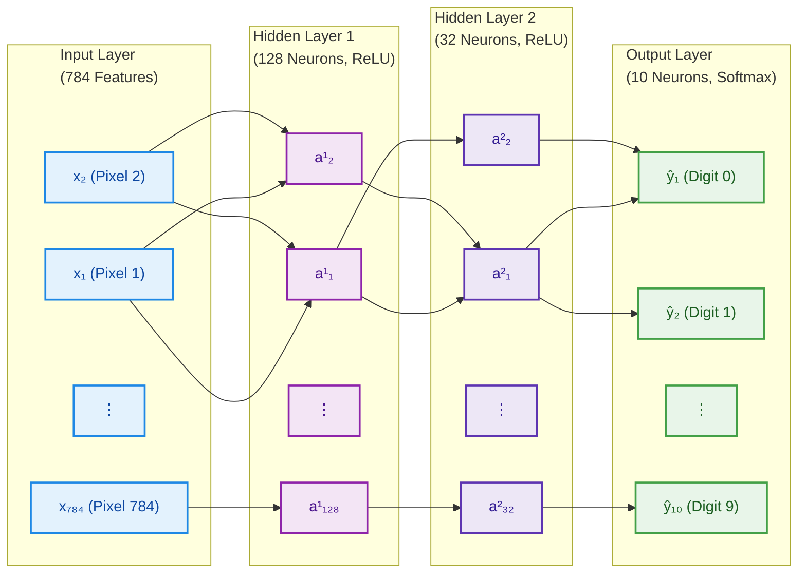

# Neural Network from Scratch 

A fully-connected neural network built using **only NumPy** — no PyTorch, no TensorFlow.  
Trained and evaluated on the **MNIST** handwritten digit dataset (~98% test accuracy).

> Based on: [How to build a neural network from zero — Towards Data Science](https://towardsdatascience.com/building-a-neural-network-from-scratch-8f03c5c50adc/)

---

## Project Structure

```
neural_network_from_scratch/
│
├── nn/                        ← Core library (pure NumPy)
│   ├── __init__.py
│   ├── activations.py         ← ReLU, Sigmoid, Tanh, Leaky ReLU, Softmax
│   ├── losses.py              ← Cross-Entropy, BCE, MSE + gradients
│   ├── network.py             ← NeuralNetwork class (forward, backprop, GD)
│   └── utils.py               ← Data loading, encoding, visualization
│
├── train.py                   ← End-to-end training script (configure here)
├── gradient_check.py          ← Numerical gradient verification
├── requirements.txt
└── README.md
```

---

## Quick Start

```bash
# 1. Install dependencies
pip install -r requirements.txt

# 2. Verify gradients are correct (takes ~10 seconds)
python gradient_check.py

# 3. Train on MNIST
python train.py
```

> **Windows tip**: If you see `UnicodeEncodeError`, run with UTF-8 mode:
> ```powershell
> $env:PYTHONUTF8=1; python train.py
> ```

MNIST (~12 MB) is downloaded automatically on the first run via scikit-learn.

---

## How It Works

### Architecture



You can change the architecture freely in `train.py`:

```python
CONFIG = {
    "layer_sizes":        [784, 128, 32, 10],   # any depth / width
    "hidden_activation":  "relu",               # relu | sigmoid | tanh | leaky_relu
    "learning_rate":      0.03,
    "epochs":             200,
    "batch_size":         None,                 # None = full batch; int = mini-batch
}
```

---

### Mathematics

The network utilizes superscript $[l]$ to denote the $l$-th layer. The network contains $L$ layers in total (hidden layers $1$ to $L-1$, and output layer $L$).

#### Forward Pass

For each layer $l$ (where $l = 1, \dots, L$):

$$\mathbf{Z}^{[l]} = \mathbf{W}^{[l]} \mathbf{A}^{[l-1]} + \mathbf{b}^{[l]}$$
$$\mathbf{A}^{[l]} = g(\mathbf{Z}^{[l]})$$

Where:
- $\mathbf{A}^{[0]} = \mathbf{X}$ is the input data matrix of shape $(n^{[0]}, m)$, where $m$ is the batch size and $n^{[0]}$ is the number of features.
- $\mathbf{W}^{[l]}$ is the weight matrix of shape $(n^{[l]}, n^{[l-1]})$.
- $\mathbf{b}^{[l]}$ is the bias vector of shape $(n^{[l]}, 1)$, broadcasted to shape $(n^{[l]}, m)$.
- $\mathbf{Z}^{[l]}$ is the linear pre-activation matrix of shape $(n^{[l]}, m)$.
- $\mathbf{A}^{[l]}$ is the activation matrix of shape $(n^{[l]}, m)$.
- $g(\cdot)$ is the activation function (e.g., ReLU for hidden layers, Softmax for the output layer).

#### Loss (Categorical Cross-Entropy)

For multi-class classification with $C$ classes and a mini-batch of size $m$, the loss is computed as:

$$\mathcal{L} = -\frac{1}{m} \sum_{i=1}^{m} \sum_{k=1}^{C} y_{i,k} \log(\hat{y}_{i,k})$$

Where:
- $y_{i,k}$ is the ground truth (one-hot encoded, $1$ if sample $i$ is of class $k$, otherwise $0$).
- $\hat{y}_{i,k}$ is the predicted probability of class $k$ for sample $i$ (the output activation $A^{[L]}_{k,i}$).

#### Backpropagation

Starting from the output layer $L$ and propagating backwards through layers $l = L, \dots, 1$:

1. **Output Layer Error Gradient** (combining Softmax and Categorical Cross-Entropy):
   $$\text{d}\mathbf{Z}^{[L]} = \frac{1}{m} (\mathbf{A}^{[L]} - \mathbf{Y})$$

2. **Hidden Layer Gradients** (for $l = L-1, \dots, 1$):
   $$\text{d}\mathbf{A}^{[l]} = (\mathbf{W}^{[l+1]})^T \text{d}\mathbf{Z}^{[l+1]}$$
   $$\text{d}\mathbf{Z}^{[l]} = \text{d}\mathbf{A}^{[l]} \odot g'(\mathbf{Z}^{[l]})$$

3. **Gradients w.r.t. Weights and Biases**:
   $$\text{d}\mathbf{W}^{[l]} = \text{d}\mathbf{Z}^{[l]} (\mathbf{A}^{[l-1]})^T$$
   $$\text{d}\mathbf{b}^{[l]} = \sum_{\text{columns}} \text{d}\mathbf{Z}^{[l]}$$

Where:
- $\odot$ denotes the element-wise (Hadamard) product.
- $g'(\cdot)$ is the first derivative of the activation function $g(\cdot)$.
- $\text{d}\mathbf{b}^{[l]}$ is summed across the batch (columns of $\text{d}\mathbf{Z}^{[l]}$), maintaining the shape $(n^{[l]}, 1)$. Since $\text{d}\mathbf{Z}^{[L]}$ is pre-divided by $m$, these gradients are already normalized.

#### Parameter Update (Gradient Descent)

For each layer $l$:

$$\mathbf{W}^{[l]} \leftarrow \mathbf{W}^{[l]} - \alpha \, \text{d}\mathbf{W}^{[l]}$$
$$\mathbf{b}^{[l]} \leftarrow \mathbf{b}^{[l]} - \alpha \, \text{d}\mathbf{b}^{[l]}$$

Where $\alpha$ is the learning rate.

---

### Weight Initialization

To prevent gradients from vanishing or exploding, the weights $\mathbf{W}^{[l]}$ are initialized from a normal distribution scaled according to the chosen activation function:

| Activation | Strategy | Scale ($\sigma$) | Distribution |
| :--- | :--- | :--- | :--- |
| **ReLU** / **LeakyReLU** | He (Kaiming) Initialization | $\sqrt{\frac{2}{n^{[l-1]}}}$ | $\mathbf{W}^{[l]} \sim \mathcal{N}\left(0, \frac{2}{n^{[l-1]}}\right)$ |
| **Sigmoid** / **Tanh** | Xavier (Glorot) Initialization | $\sqrt{\frac{1}{n^{[l-1]}}}$ | $\mathbf{W}^{[l]} \sim \mathcal{N}\left(0, \frac{1}{n^{[l-1]}}\right)$ |

Here, $n^{[l-1]}$ represents the number of input units in the preceding layer. Biases $\mathbf{b}^{[l]}$ are initialized to zero.

---

## Expected Results

| Metric            | Value    |
|-------------------|----------|
| Train Accuracy    | ~98%     |
| Test Accuracy     | ~97%     |
| Epochs            | 200      |
| Learning Rate     | 0.03     |
| Architecture      | 784→128→32→10 |

---

## Files Generated

After training, the `output/` directory will contain:

| File                      | Description                        |
|---------------------------|------------------------------------|
| `training_history.png`    | Loss & accuracy curves             |
| `confusion_matrix.png`    | Per-class prediction heatmap       |
| `sample_predictions.png`  | 25 random test images + predictions|
